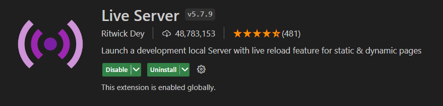
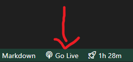

# Desafio Técnico 1 

## Descrição
Este projeto é uma representação de uma vitrine online com diversas funcionalidades interativas. Ele foi desenvolvido utilizando HTML, CSS e JavaScript para demonstrar habilidades técnicas e criatividade no desenvolvimento web.

## Como Utilizar

- Acesse por : https://thullyoo.github.io/Desafio_Tecnico_1/

## Ou acesse manualmente:

### Pré-requisitos
- **Visual Studio Code**: Certifique-se de ter o Visual Studio Code instalado em seu sistema.
- **Live Server Extension**: Instale a extensão "Live Server" no Visual Studio Code para facilitar a execução do projeto.

### Passos para Executar
1. **Instale a Extensão Live Server**:
    - No Visual Studio Code, vá para a aba de extensões (ícone de quadrado no painel lateral esquerdo).
    - Pesquise por "Live Server" e clique em "Instalar".

2. **Execute o Projeto**:
    - Com o projeto aberto no Visual Studio Code, clique com o botão direito no arquivo `index.html`.
    - Selecione "Open with Live Server".
    - Alternativamente, clique no botão "Go Live" no canto inferior direito do Visual Studio Code.

## Tecnologias Utilizadas
- **HTML**
- **CSS**
- **JavaScript**
